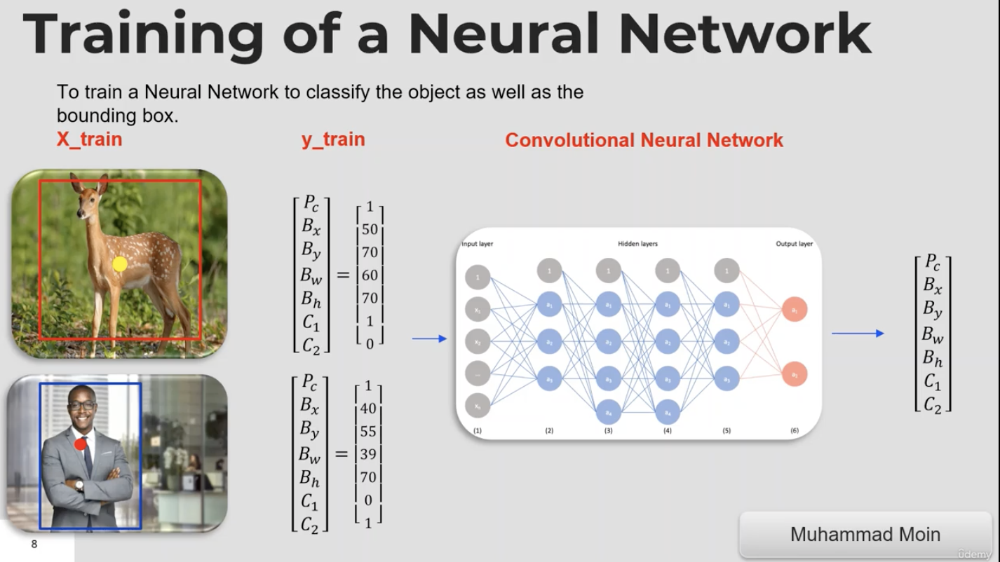
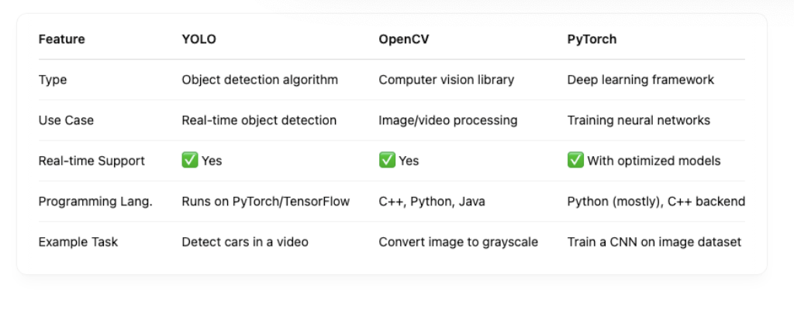
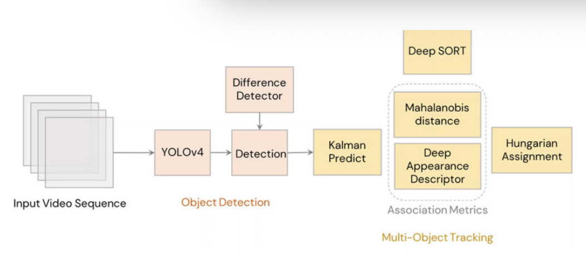

# YOLOv8 Object Detection with DeepSORT Tracking (ID + Trails)

## YOLO (You Only Look Once)

YOLO is an object detection algorithm that outperforms RCNN, Fast R-CNN, Faster R-CNN, and Mask R-CNN. YOLO is known for its speed and efficiency in detecting multiple objects within an image or video stream. 

- **Image Classification:** A convolutional neural network (CNN) classifies objects in an image.
- **Object Localization:** YOLO provides both classification and the bounding box (position of the object in the image).

When multiple objects are present in an image, YOLO performs well by:

1. Using **Intersection Over Union (IoU)** to get unique bounding boxes.
2. Resolving grid cells that contain the centre of more than one object.




### Comparison with RNN, RCNN, Fast RCNN, Faster RCNN, and Mask R-CNN:

CNNs struggle with multiple objects in an image. Here’s how the different models perform:

- **R-CNN:** Makes regions and feeds them into a feature extractor, but it’s slow.
- **Fast R-CNN:** Sends the whole image into the feature extractor, but still uses region proposals which slow things down.
- **Faster R-CNN:** Uses a Region Proposal Network (RPN) to predict region proposals directly, making it faster.
- **Mask R-CNN:** Extends Faster R-CNN to pixel-level segmentation, making it suitable for object segmentation tasks.

### YOLO Evolution:

YOLO has rapidly evolved, and the latest version offers significant improvements in terms of speed, accuracy, and usability. Performance is evaluated using datasets like **COCO**, **Roboflow**, **Kaggle**, and **Open Images**. (Clone the IOD v4 toolkit to download images from the **annotated** Open Image Dataset.)




## Implementation with YOLOv8 + DeepSORT

### Overview:

This implementation combines YOLOv8 for object detection with DeepSORT for object tracking and identification. DeepSORT uses motion and appearance features to accurately track and ID objects across frames. Applications include manufacturing, robotics, sports, and autonomous vehicles. This project was developed using both **Google Colab** and **Visual Studio Code**.


### 1) YOLOv8 Object Detection

- [Kiwi Detection YOLO Google Colab File](https://drive.google.com/file/d/1HC6MzhbTIbLKyprUjc8flm7mwRyLk5aw/view?usp=drive_link)
- [Video: Kiwi Detection YOLO](https://drive.google.com/file/d/1qUvtmcOPjccWhESFXdSoyxVZYHckWE2A/view?usp=drive_link)

This includes **real-time analysis** aligned with use cases in security, robotics, and autonomous vehicles:

- [Video: Live Cam Detection](https://drive.google.com/file/d/14Cym6OSh0YdzHOvUzhiFWdMUaCo9rrkW/view?usp=drive_link)

  

### 2) YOLOv8 + DeepSORT Object Tracking

DeepSORT uses a motion predictor (Kalman filter) and appearance features to track objects. The center of the bounding box is stored in a buffer for trail visualization and ID consistency.

- [Object Tracking DEEPSORT Colab File](https://drive.google.com/file/d/1iayVqeYdT7QjwX-rHTUgqyEOjX3VpDCF/view?usp=drive_link)

- [Video: Object Detection](https://drive.google.com/file/d/1mU2CBXApxPugRhiBG6kgdAo-8zTmp8LF/view?usp=drive_link)





### Challenges:

- Needed to collect and annotate enough data (even extracted frames from YouTube videos).
- Time-consuming annotation process due to the lack of publicly available Kiwi datasets.
- Handling version updates and fixing associated bugs.

### Future Planning:

- Implement counting (requires a stable camera angle and virtual line logic).
- Improve accuracy via segmentation, especially important for autonomous vehicle applications.

## Setup

### Clone the Repository:

```
git clone https://github.com/m-chuu/KiwiDetectionYOLO_mchuu.git
```

Ensure you're using the correct versions of the required libraries and dependencies for YOLOv8 and DeepSORT integration.

